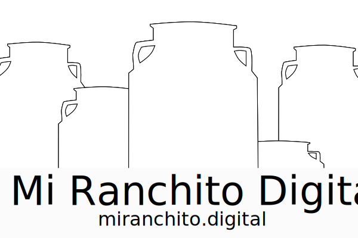

## Visita [MiRanchito.digital](https://miranchito.digital)

# Contenido

- ## [Motivaciones](#motivaciones)
- ## [Inicio Rapido](#Inicio-rapido)
- ## [Caracteristicas Incluidas](#Caracteristicas-incluidas)
- ## [Caracteristicas Futuras](#caracterisitcas-futuras)
- ## [Herramientas de desarrollo](#Herramientas-de-desarrollo)
- ## [Bugs y requests](#Bugs-y-requests)

## Motivaciones

El Software puede contribuir a optimizar la producción agricola. Pero este debe ser económico y accesible

## Inicio Rapido

```

git clone git@github.com:raulzarzadev/mi-ranchito.git

cd mi-ranchito/

yarn dev

yarn build

yarn start

```

Variables de entorno ( Firebase Config )

```

PROJECT_ID

PRIVATE_KEY

CLIENT_EMAIL


```

## Caracteristicas Incluidas

- Dashboard interactivo para monitoreo del estado del ganado lechero
- Registro y seguimiento de eventos

## Caracterisitcas Futuras

- Funcionalidad sin internet
- Registros de producción de leche
- Segimiento Genealogico

## Herramientas de desarrollo

- Nextjs
- Material UI (+/- 10%)
- Firebase
- Slint & pretier

## Bugs y requests

Puedes hacer pullrequests y seran aceptados siempre y cuando cumplan con requisitos minimos de claridad

Reporta un bug, excribeme en [github](https://github.com/raulzarzadev)
